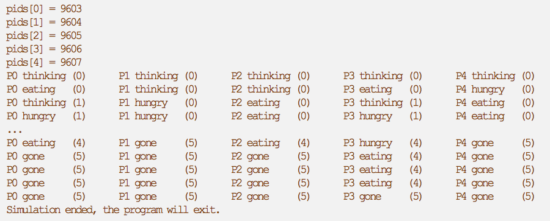

### Objective
The purpose of this lab is to put into practice what we have seen in the classroom regarding race conditions, critical regions and resource protection. You will also become familiar with the Linux Application Programming Interface (API) for process management, creating shared memories and using semaphores.

### Introduction
Race conditions occurs when two or more processes read or write shared data and the end resulting order of process execution leads to corrupted or unexpected data values. To troubleshoot a race condition, it is necessary to identify the sections of code where shared data is accessed to ensure that only one process at a time executes this code. These sections are referred to as <b>critical regions</b>. To avoid race conditions, it is necessary to ensure mutual exclusion; having only one process at a time in the critical region. As we saw in class, different solutions exist. Some are software such as <i>strict alternation</i> or <b><i>Peterson's solution</i></b>. Others require hardware support such as the <b>TSL (Test and Set Lock)</b> instruction. Other more advanced solutions implemented by software libraries or the programming language are <b><i>semaphores, mutexes</i></b> and <b><i>monitors</i></b>.

In this lab, you will modify and develop C programs to solve race conditions and process synchronization problems using strict alternation, Peterson's solution, mutexes, and semaphores. Note that monitors do not exist in C language, but are part of other languages such as Java and C #.

For this lab, you will use the same Linux virtual machine (VM) as in the previous lab. Make sure that the `C:\Users\Public\Documents\share` directory is still present on your computer before starting VM, otherwise it will freeze during startup.

### Part I – Race Conditions
In the first part of the lab, you will analyze a C program that consists of one or more worker processes that generate text to print and one or more printer processes that print the generated text. The initial C code is available [here](./Files/lab4a_start_code.7z) and on the course Moodle site. After downloading the .zip files, extract the lab4a folder to the desktop of your virtual machine. To import the project, start Eclipse and select `File -> Import -> General -> Existing Projects into Workspace`, then navigate to the `lab4a` folder and make sure to select the `Copy projects into workspace` option before clicking Finish. You can now compile and run the program. The following menu should appear on the console:

```
Which mutual exclusion approach do you want to test?
0. Free for all
1. Strict Alternation
2. Peterson's Solution
3. Semaphore
4. Quit
```
<br>
#### Free for all
Choose option 0 to execute the free for all. This name comes from the fact that the program does not implement any mutual exclusion or synchronization between the threads. Analyze the code in the `demo_freeforall(` function and observe the program's output to understand how it works. In this function, a first thread is created to execute the `freeforall_process()` function. After a wait of 1 second, another thread is created to execute the `freeforall_printer()` function. The first thread generates jobs to print while the second prints them.

Now answer the following questions:

   1\. How does the first thread (the worker thread) send the texts to the second thread (the printer thread)? Be specific in your answer.<br>
   2\. What data is shared by both threads?<br>
   3\. What is the role of the `it_next_add` and `it_next_remove variables`?<br>
   4\. Allow the program to run until the printer thread prints at least 8 jobs. What synchronization problem do you observe? Explain the cause.

#### Strict Alternation
Now choose option 1. You should observe the same behavior as in the previous example. Your job is to solve the problem using strict alternation. To do this, you must modify the `strict_printer()` and `strict_process()` functions of the `strict_alternation.c` file, making sure you do not change the `sleep()` function times. You can also add global variables to this file if necessary. You must not modify the `demo_strict_alternation()` function or any other file in the program.

   5\. The strict alternation method solves the observed problem, but is not optimal. What is its main disadvantage? Explain in the context of the code in this program.

#### Peterson’s Solution
Now choose option 2. The program now creates two worker processes and a printer process. Analyze the code of the program and watch its output.

   6\. What new problem of critical competition do you observe? Explain the cause.

Implement the Peterson solution to solve this problem. You must change the `peterson_process()` function, but do not change the `sleep()` function timeout. Add other functions or global variables to the `peterson.c` file, but do not modify any other function or files.

<b>Note:</b> As you likely expected, your solution will still suffer from the problem with the circular buffer. This problem will be solved with the next method.

   7\. What is the disadvantage or rather the limitation of Peterson's solution?

#### Semaphores
Now choose option 3. The program creates two worker processes and two printer processes. Analyze the code of the program and watch its output. You will notice that the program actually implements the producer/consumer problem. Use mutexes and semaphores to correct any race conditions and synchronization issues. In your implementation, you will need the `sem_init()`, `sem_wait()` and `sem_post()` functions that are described in the [Linux Programmer's Manual](http://man7.org/linux/man-pages/man3/sem_init.3.html) available online. When you finish, answer the following questions:

   8\. Compared with your previous solutions, what are the advantages of using mutexes and semaphores in this program?<br>
   9\. Where are the semaphores defined in the Linux kernel? Refer to the directory used in the previous laboratory.<br>
   10\. In your code, you use the `sem_wait()` function. Why does this function not exist in the Linux kernel?<br>
   11\. Explain how the down function on semaphores is implemented in the Linux kernel.

### PART II – Dining Philosopher’s
The Dining Philosophers Problem was proposed by Djikstra in 1965 and consisted of coordinating the access of five computers to five magnetic tapes. The current and more amusing formulation of the problem was developed by another computer scientist named Tony Hoare. This problem illustrates a number of interesting points regarding critical resources that apply to various situations:

- Multiple threads use multiple resources;
- Different sets of resources are used by different threads;
- The amount of time a thread uses resources may vary;
- The time between the use of resources may also vary;
- Deadlock can occur when all threads wait for another thread to finish; and
- Deprivation of resources can also occur regardless of deadlock if the program continues to run, but never progresses.

Few real-world problems directly correspond that explicitly described by the Dining Philosophers, but many share its features: multiple threads, multiple resources, and various patterns of resource use. Solutions to the Dining Philosophers' Problem can therefore be adapted to many real situations.  As we have seen in class and as explained in your textbook, the Dining Philosophers' Problem consists of five philosophers seated around a circular table. Every philosopher has a plate of spaghetti. Spaghetti is so slippery that a philosopher needs two forks to eat it. A fork is between each plate as shown in Figure 1 below. Each philosopher alternates between eating and thinking. When a philosopher is hungry, he tries to acquire one fork and then the other fork, one at a time, in any order. If he succeeds in acquiring the two forks, the philosopher eats a moment, then rests them on the table to continue thinking.

<p align="center">

</p>

In section 2.5 of your course text book, Modern Operating Systems 4th edition, Tanenbaum provided a solution to the Dining Philosophers’ Problem, shown below.

```c
#define N           5           /* number of philosophers */
#define LEFT        (i+N−1)%N   /* number of i’s left neighbor */
#define RIGHT       (i+1)%N     /* number of i’s right neighbor */
#define THINKING    0           /* philosopher is thinking */
#define HUNGRY      1           /* philosopher is trying to get for ks */
#define EATING      2           /* philosopher is eating */

typedef int semaphore;          /* semaphores are a special kind of int */
int state[N];                   /* array to keep track of everyone’s state*/
semaphore mutex = 1;            /* mutual exclusion for critical regions */
semaphore s[N];                 /* one semaphore per philosopher */

void philosopher(int i){        /* i: philosopher number, from 0 to N−1 */
    while (TRUE) {              /* repeat forever */
        think( );               /* philosopher is thinking */
        take forks(i);          /* acquire two for ks or block */
        eat( );                 /* yum-yum, spaghetti */
        put forks(i);           /* put both for ks back on table */
    }
}

void take forks(int i){         /* i: philosopher number, from 0 to N−1 */
    down(&mutex);               /* enter critical region */
    state[i] = HUNGRY;          /* record fact that philosopher i is hungry */
    test(i);                    /* try to acquire 2 forks */
    up(&mutex);                 /* exit critical region */
    down(&s[i]);                /* block if for ks were not acquired */
}

void put forks(i){              /* i: philosopher number, from 0 to N−1 */
    down(&mutex);               /* enter critical region */
    state[i] = THINKING;        /* philosopher has finished eating */
    test(LEFT);                 /* see if left neighbor can now eat */
    test(RIGHT);                /* see if right neighbor can now eat */
    up(&mutex);                 /* exit critical region */
}

void test(i){                   /* i: philosopher number, from 0 to N−1 */
    if (state[i] == HUNGRY && state[LEFT] != EATING && state[RIGHT] != EATING) {
        state[i] = EATING;
        up(&s[i]);
        }
}
```

In the second part of this lab, your task is to develop a C program that implements the Tanenbaum solution. Your program must meet the following requirements:

- Each philosopher must be implemented by a different process;
- Synchronization between processes must be implemented using POSIX named (POSIX named semaphore) type semaphores;
- The data shared by the processes must be implemented by POSIX named shared memory (POSIX);
- The simulation must count 5 philosophers;
- Each philosopher must eat for 3 seconds;
- Each philosopher must think for 2 seconds;
- A philosopher has finished after repeating the cycle (thinking - hunger - eating) 5 times. So you have to implement 4 different states: think, hunger, eat and finish;
- Constants (number of philosophers and waiting times) must be defined by pre-compiler definitions;
- An additional process must print to the console, the state and cycle number for each philosopher every second;
- When creating processes your program must display the PID of the processes created;
- To help debug your program, you can also print other information; and
- The output of your program should, at a minimum, be similar to this:



#### Implementation – Iterative Approach
To implement your C program, it is recommended that you follow an iterative approach where each iteration is a functional program. First, create a new C project in Eclipse by selecting `File->New->C/C++Project`. In the window that appears, select `C Managed Build` and click `Next`. Name the project `lab4b` and choose `Hello World AINSI C Project` and `Linux GCC` then click on `Next`, then `Next` a second time and finally on `Finish`. Once created, update the header of the `lab4b.c file`. You must also configure the project settings by selecting from the `Project -> Properties -> C/C++ Build -> Settings` menu bar. Then do the following configurations:

- `GCC C Compiler -> Miscellaneous ->` Check `Support for pthreads`;
- `GCC C Linker -> General ->` Check `Support for pthreads`; and
- `GCC C Linker -> Libraries (-l) ->` Add a line containing `rt`.

You can now compile and run the program. Once done, clear the contents of the main function and proceed to iteration 1.

#### Iteration 1:  Process Creation and Destruction  
This iteration consists of implementing the `main()` function of your program. The parent process creates the child processes using the `fork()` function. If successful, `fork()` returns the PID of the child process to the parent process and 0 to the child process. In case of failure, `fork()` returns -1 to the parent and no child process is created. The details of the `fork()` function are available in the online [Linux Programmer's Manual](http://man7.org/linux/man-pages/man2/fork.2.html). In fact, all the functions of the Linux API that we use in this lab are available on this site. After creating a child process, the parent process must print to the console the PID of the created process.

Each process must then call the function `philosopher(int i)` where the parameter `int i` represents the number (0, 1, 2, ...) of the philosopher. For the moment, this function simply `prints I am the philosopher i` and then quits using the `_exit()` function. Notice the "_" before exit. The `exit()` and `_exit()` functions are not the same. When a program creates child processes with `fork()`, it is recommended to use `_exit()` to terminate the child and `exit()` to terminate the parent process. Refer to the Linux Programming Manual for more details.

After the child processes are created, the parent process must call the function `parent()`. This function will be used later to print the state of the philosophers. For the moment, it only prints `I am the parent process`. When the `parent()` function finishes, the parent process must wait for the child processes to complete using the function `waitpid(pid_t pid, int *wstatus, int options)`. In our case, only the `pid_t pid` parameter will be used. In your code, the function call should look like `waitpid (pid, NULL, 0)`.  To compile your code, you will need to include the following header files:

```c
#include <stdio.h>      //needed for printf, sprintf, ...
#include <stdlib.h>     //needed for exit()
#include <unistd.h>     //needed for sleep, fork, waitpid, _exit, ftruncate
#include <sys/wait.h>   //needed for waitpid
```

At the end of this iteration, the output of your program should look like this (don’t be surprised if the order of your output is not the same, that is normal):

```c
pids[0] = 9603
pids[1] = 9604
pids[2] = 9605
pids[3] = 9606
pids[4] = 9607
I am the philosopher 0
I am the philosopher 1
I am the philosopher 2
I am the philosopher 3
I am the philosopher 4
I am the parent process`. 
```

When you have confirmed that your code for iteration 1 is working correctly. Make a backup copy that you will name `lab4b_iter1.c`.

#### Iteration 2:  Adding shared memory
In this iteration, you will add to your program a named memory section that will be shared by all your processes. This is named shared memory since it is associated with a file in the `/dev/shm` directory. It is possible to have an anonymous shared memory that is not associated with a file, but this is not the approach used in this lab. To use the named shared memory, read sections 1.0 to 4.3 of this [online tutorial](https://www.softprayog.in/programming/interprocess-communication-using-posix-shared-memory-in-linux) first. Do not use the example given in section 5.0 of the tutorial, this one is too complicated for no reason. Use the following code instead to initialize shared memory.

```c
int fd_shm;     // inode number of the shared memory file
if ((fd_shm = shm_open("philo_shared", O_RDWR | O_CREAT, 0660)) == -1){
    printf("Function shm_open() failed\n");
    exit(-1);
}

if (ftruncate(fd_shm, sizeof(struct shared_memory)) == -1){
    printf("Function ftruncate() failed\n");
    exit(-1);
}

if ((shared_mem = mmap(NULL, sizeof(struct shared_memory), PROT_READ | PROT_WRITE, MAP_SHARED, fd_shm, 0)) == MAP_FAILED) {
    printf("Function mmap() failed\n");
    exit(-1);
}
```

In this code, the `shm_open()` function opens the shared memory object that is mapped to the `/dev/shm/philo_shared` file. The object is opened with the option `O_RDWR` to allow reading and writing, the option `O_CREAT` allows to create the object (and also the file) if it does not already exist and the option `0660` is the Unix permission of the file. This function returns the number of the inode associated with the file or -1 if an error has occurred.

The `ftruncate()` function sets the size of the shared memory. In our case, it has a size just enough to contain a `shared_memory` structure. You must define this structure yourself. If you wish, you can name it otherwise. The function returns -1 if it fails.

The `mmap()` function maps the shared memory object to the virtual memory space of the process. Here, the `NULL` argument means that the kernel itself can choose the address where the object will be mapped, the argument `sizeof(struct shared_memory)` is the size of the object in bytes, the `PROT_READ` and `PROT_WRITE` options are the protections applied to the memory space, the `MAP_SHARED` argument specifies that the map updates are visible to other processes mapping the same region and are also visible in the underlying file in `/dev/shm/`, the argument `fd_shm` is the inode number of the underlying file and, finally, the `0` argument is the offset within the file where the shared object is located. The function returns a pointer to the shared object. In this example, `shared_mem` is a pointer to `struct shared_memory`.

To end the shared memory object, you will need to use the following code:

```c
if (munmap(shared_mem, sizeof(struct shared_memory)) == -1) {
    printf("Function munmap() failed\n");
    exit(-1);
}
if ((shm_unlink("philo_shared")) == -1){
    printf("Function shm_unlink() failed\n");
    exit(-1);
}
```

In this code, the `munmap()` function ends the mapping of the shared memory object to the address specified by the first parameter and having the size specified by the second parameter. Here, `shared_mem` is a pointer to the shared structure that is of type `struct shared_memory`.

The `shm_unlink()` function deletes the name of the shared memory object and deletes the file created in `/dev/shm/`.

In your implementation of iteration 2, initialization of shared memory must be done by the parent process before the child processes are created. The destruction must be done after the child processes have finished.

To test your program, add an `int k` variable int to your shared structure. The parent process initializes this variable to `0` before creating the child processes. The child processes execute the following code where `shared` is a pointer to the shared structure:

```c
void philosopher(int i) {
    for (int j = 0; j < 100; j++) {
        int temp = shared_mem->k;
        temp++;
        usleep(5);
        shared_mem->k = temp;
        usleep(5);
    }
    printf("I am philosopher %d     k=%d\n", i, shared_mem->k);
}
```

Before compiling your code, you will need to add the following header files to those already present:

```c
#include <fcntl.h>      //For O_* constants
#include <sys/mman.h>   //needed for mmap, munmap and associated constants
```

You can now run your program. When you have confirmed that your code for iteration 2 is working correctly. Make a backup copy that you will name `lab4b_iter2.c`.

   12\: Explain how the output of your program demonstrates that structure variable k is indeed shared among the five processes.<br>
   13\: Explain why the value of k printed by the processes is not 500.

#### Iteration 3:  Adding Semaphores
In this iteration, you will correct the situation observed in the previous iteration using a mutex semaphore. As in Part 1 of this lab, you will use the `sem_init()`, `sem_wait()`, `sem_post()`, and `sem_close()` functions to initialize, decrement, increment, and terminate the mutex semaphore. Unlike Part 1, you will encounter two difficulties.

The first difficulty is that the semaphore is now shared between several processes instead of multiple threads. When you call the function `int sem_init (sem_t *sem, int pshared, unsigned int value)`, make sure to pass `1` to the argument `pshared`. Refer to the [documentation for this function](http://man7.org/linux/man-pages/man3/sem_init.3.html) for more details. 

The second difficulty is that the semaphore must be shared and accessible to all processes. If you declare it in the same way as in Part 1, each process will have its own copy, which will not work. Rather, declare your semaphore inside the structure you are sharing, this will ensure that there is only one copy of the semaphore and that it is accessible by all processes.

To test your program, modify the child process code to protect the critical region using a mutex as follows:

```c
void philosopher(int i) {
    for (int j = 0; j < 100; j++) {
        sem_wait(&shared_mem->mutex);
        int temp = shared_mem->k;
        temp++;
        usleep(5);
        shared_mem->k = temp;
        usleep(5);
        sem_post(&shared_mem->mutex);
    }
    printf("I am philosopher  %d     k=%d\n", i, shared_mem->k);
}
```

To compile your code, you will need to add the following header file:

```c
#include <semaphore.h>    //needed for semaphores
```

When you have confirmed that your code for iteration 3 is working correctly. Make a backup named `lab4b_iter3.c`. Note that the value of `k` printed by philosopher 4 is now 500 which shows that you have solved the problem.

   14\: Explain why the values printed by the other processes are less than 500.

#### Iteration 4:  The final program
You now have all the tools you need to program the final version of your program. Basing your solution as much as possible on the Tanenbaum solution provided earlier in this document. Make sure you meet all the requirements. When done, verify that your program generates the output given in the requirements section. Then make a backup copy that named `lab4b_iter4.c`.

### Lab Report
Your lab report should include a cover page, a brief introduction, discussion and conclusion.  Your discussion should explain what you learned, the discoveries you made, what was difficult in the lab. It should not be a list of followed steps or empty phrases about the importance of this lab. Be concise! A good discussion paragraph is better than 10 pages of fill. The report should also include answers to the fourteen (14) questions asked throughout the lab. Be sure to include the questions in addition to the answers.  

You must submit your lab report in <u>pdf format</u> and as well as the source code for your programs in a single zip file.   Ensure you submit the following separate source code files:  `lab4a.c`, `lab4b_iter1.c`, `lab4b_iter2.c`, `lab4b_iter3.c`, `lab4b_iter4.c`.  Submit this compressed file to the course Moodle site.  


