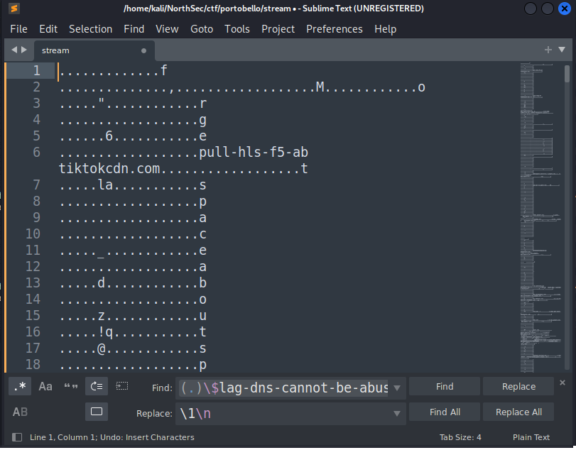
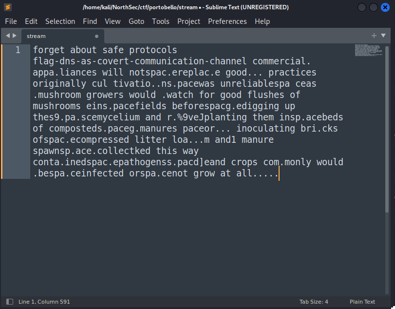
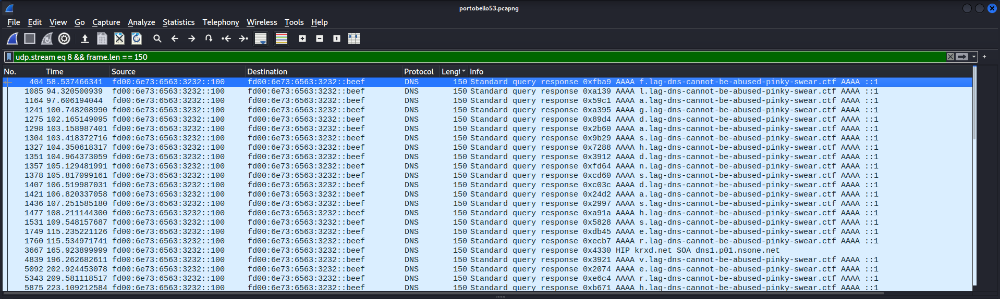

This Portobello 53 challenges revolve around DNS tunnels - primarily identifying and decoding them. For the most part, they are pretty easy to spot. DNS requires that readable characters are used, meaning arbitrary data (i.e., high entropy URLs) stand out like a sore thumb. 
The only subset of DNS tunnels that can be tricky to spot are those that rely on very low bandwidth communication, such as sending a character at a time over a long period of time. 

After downloading and opening the pcapng in Wireshark, I started off by following the UDP streams to see if anything stood out.

UDP streams 2, 4, 8, and 9 looked to be of interest. The Denial stream is UDP stream 8.

## Denial 1/2
Upon examining the UDP stream, I could see that immediately before the string "$lag-dns-cannot-be-abused-pinky-swear.ctf" were single characters that were being sent in a DNS request from \[IPV6\]::beef to \[IPV6\]::100 and returned in a AAAA record.

{: .mx-auto.d-block :}

Since the characters we're looking to isolate are repeated in both the sender and receiver, let's isolate the conversation to just one direction.

From here, we could do some commandlinefu to isolate what we want, or we could just throw it in a text editor like sublime and use *find and replace* to remove the extra junk. We can then search for *some character* followed by the string, and replace everything with just the character and a newline.

{: .mx-auto.d-block :}

Now let's isolate the last character of every line.

{: .mx-auto.d-block :}

When trying to read the string, I can see that literal " " and "-" have been replaced with "space" and "dash". A quick *find and replace* results in the following:

{: .mx-auto.d-block :}

There's obviously some extra text that this didn't properly decode, but nonetheless, we have our first flag for 1 point: **flag-dns-as-covert-communication-channel**.

## Denial 2/2

There was some additional data that was preventing our simple approach from properly decoding all the text. Let's examine UDP stream 8 again and see if anything stands out... it becomes obvious when sorting the data by the length of the packet. 

There are many response packets of length 150 that are AAAA records with *no error* flags set, whereas the data from the previous flag were taken from query or response packets of length 122, but the response packets had the *No such name* flags set.

{: .mx-auto.d-block :}

Upon closer inspection, you can easily see the word "*flag*" present in the data. Let's try to isolate it. I'll add an additional Wireshark filter on the packet length, and use a similar approach as the last challenge. 

{: .mx-auto.d-block :}

By copying all the packets right from Wireshark as *Printable Text*, then using some RegEx-fu to isolate the characters we want, we're left with:

{: .mx-auto.d-block :}

Similarly to the last flag, let's replace the literal string "dash" with the "-" character, and we have our second flag, for an additional 1 point:  
**flag-dns-serverhidinginternetnoise**.