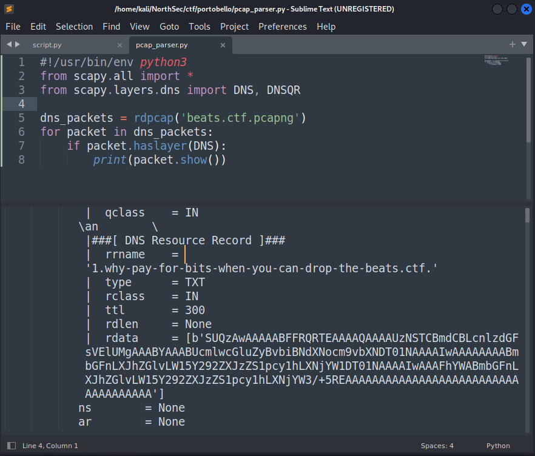

When we found the first flag, the initial packet's data decoded to "ID3TPE1S3RL ft KrystalTIT2Tripping on MushroomsCOMM#flag-radio-mycoverse-is-a-scamCOMM#XXXflag-radio-mycoverse-is-a-scam���D".

A quick google search results in the song "Tripping on Mushrooms - S3RL ft Krystal". 

Looking instead for the string "ID3TPE1", I discovered that ID3 is a metadata container, with TPE1 identifying the artist and TIT2 identifying the title of the song. ID3 is the *magic number* for an MP3 file with an ID3v2 container. 

The plan is therefore to extract all of the data from the DNS TXT Record responses, concatenate it together, and hopefully we can listen to a song and perhaps find some extra data embedded in some way (Steganography!).

## Anger 2/2

Here's the half of the communication channel with the Base64 encoded data. 

{: .mx-auto.d-block :}

There doesn't seem to be a quick and easy way to RegEx-fu the rest of this tunnel like we did for the previous flags, so lets level up and try something better.

Enter python and scapy. I filtered the original capture down to just the relevant packets and saved it as a new pcap for use in a script. A quick test shows the pcap was correctly parsed and the data we want is present in the *rdata* field of the DNSRR.

{: .mx-auto.d-block :}

Now all that's left is to grab all the data and stick it together, then write it to a file which we can then try to listen to.

{: .mx-auto.d-block :}

Upon listening to the mp3, which is a short 28 second clip, the song (Tripping on Mushrooms) is interrupted by someone who says "pardon the interruption but the flag is ... flag*dash*radiocashmoneymushroom247". So there's our next flag, for 2 points this time:  
**flag-radiocashmoneymushroom247**.
