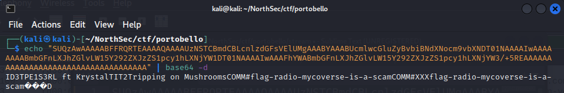

Looking through the other interesting UDP streams from portobello53.pcapng, UDP stream 2 stood out and appeared to contain some Base64 encoded data. 

## Anger 1/2

In this stream, the data flow was between \[IPV6\]::3 and \[IPV6\]::100. Specifically, \[IPV6\]::3 was sending DNS TXT record queries, the responses of which contained the interesting data.

{: .mx-auto.d-block :}

Let's grab the data from the first packet to confirm it is in fact Base64 encoded...

{: .mx-auto.d-block :}

Well that didn't take much. First flag in the Anger stream found for 1 point:  
**flag-radio-mycoverse-is-a-scam**.
