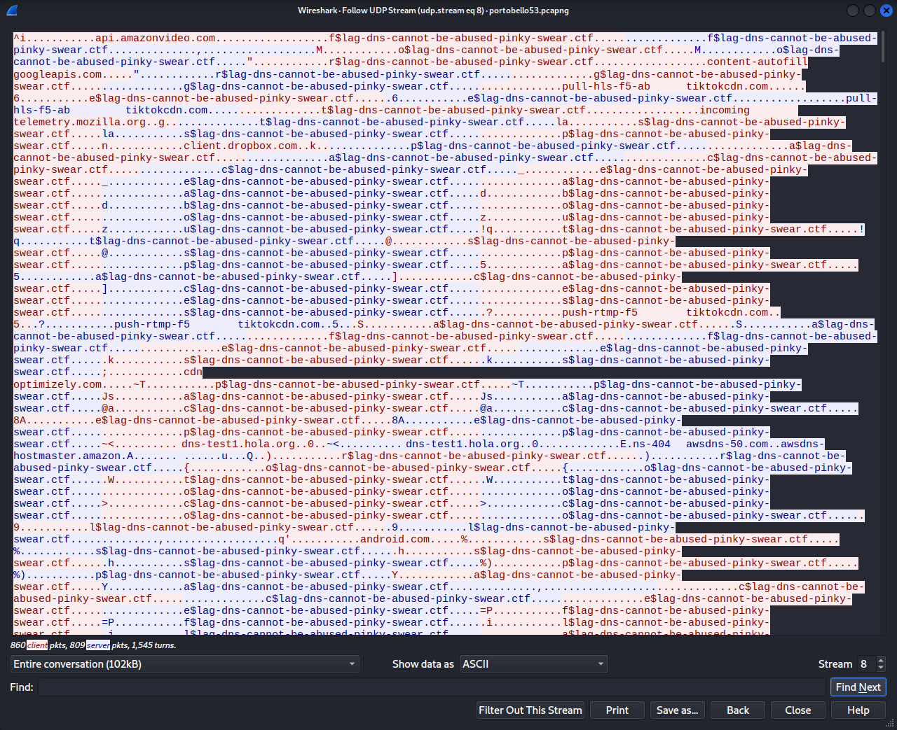
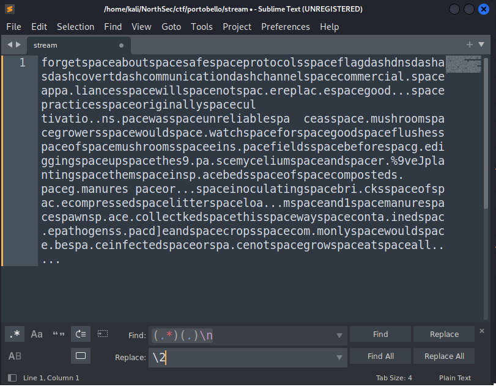

This stream revolves around DNS tunnels - primarily identifying and decoding them. For the most part, they are pretty easy to spot. DNS requires that readable characters are used, meaning arbitrary data (i.e., high entropy URLs) stand out like a sore thumb. 
The only subset of DNS tunnels that can be tricky to spot are those that rely on very low bandwidth communication, such as sending a character at a time over a long period of time. 

After downloading and opening the pcapng in Wireshark, I started off by following the UDP streams to see if anything stood out.

UDP streams 2, 4, 8, and 9 looked to be of interest. The Denial stream is UDP stream 8.

## Denial 1/2
Upon examining the UDP stream, I could see that immediately before the string "$lag-dns-cannot-be-abused-pinky-swear.ctf" were single characters that were being sent in a DNS request from \[IPV6\]::beef to \[IPV6\]::100 and returned in a AAAA record.

{: .mx-auto.d-block :}

Since the characters we're looking to isolate are repeated in both the sender and receiver, let's isolate the conversation to just one direction.

From here, we could do some commandlinefu to isolate what we want, or we could just throw it in a text editor like sublime and use *find and replace* to remove the extra junk. We can then search for *some character* followed by the string, and replace everything with just the character and a newline.

{: .mx-auto.d-block :}

Now let's isolate the last character of every line.

{: .mx-auto.d-block :}

When trying to read the string, I can see that literal " " and "-" have been replaced with "space" and "dash". A quick *find and replace* results in the following:

{: .mx-auto.d-block :}

There's obviously some extra text that this didn't properly decode, but nonetheless, we have our first flag for 1 point: **flag-dns-as-covert-communication-channel**.
