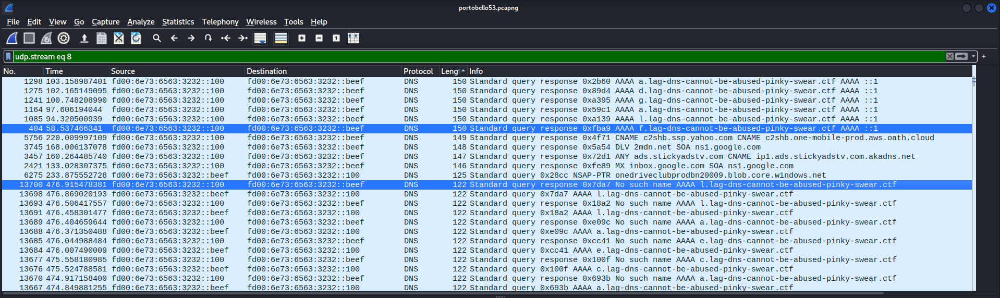
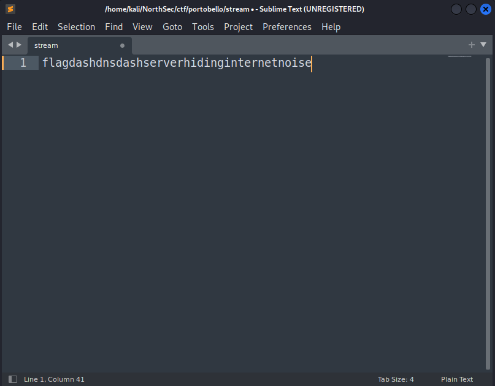

## Denial 2/2
Based on the first Denial flag, there was some additional data that was preventing our simple approach from properly decoding all the text. Let's examine UDP stream 8 again and see if anything stands out... it becomes obvious when sorting the data by the length of the packet. There are many response packets of length 150 that are AAAA records with *no error* flags set, whereas the data from the previous flag were taken from query or response packets of length 122, but the response packets had the *No such name* flags set.

{: .mx-auto.d-block :}

Upon closer inspection, you can easily see the word "*flag*" present in the data. Let's try to isolate it. I'll add an additional Wireshark filter on the packet length, and use a similar approach as the last challenge. 

{: .mx-auto.d-block :}

By copying all the packets right from Wireshark as *Printable Text*, then using some RegEx-fu to isolate the characters we want, we're left with:

{: .mx-auto.d-block :}

Similarly to the last challenge, let's replace the literal string "dash" with the "-" character, and we have our second flag, for an additional 1 point: **flag-dns-serverhidinginternetnoise**.