This challenge revolves around a custom N64 game created for NSec, and is of course mushroom themed. 

The challenge instructions provide a few files, including Project64.exe, a Nintendo 64 Emulator. Before we start a deep dive into the game file (`legend_of_shiitakoin.n64`), let's try to load the game and make sure everything works correctly.

## Initial Exploration

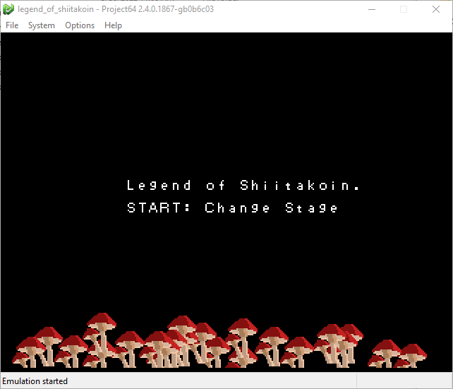{: .mx-auto.d-block :}

By exploring the options, I found the key mapping from keyboard to an N64 controller, so I would know how to control my potential character or otherwise play the game.

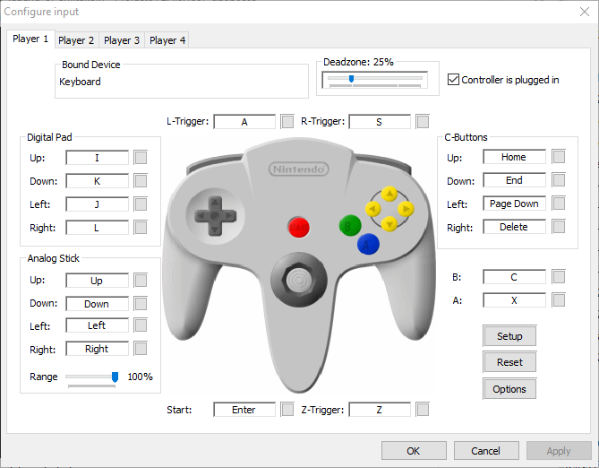{: .mx-auto.d-block :}

By pressing start (enter), I could cycle between the loading screen and two *stages*.

The first stage accepts 4 hexadecimal numbers as input. I tried a few obvious options like `0xDEADBEEF`, and the game would print `INCORRECT` overlayed with the inputs. 

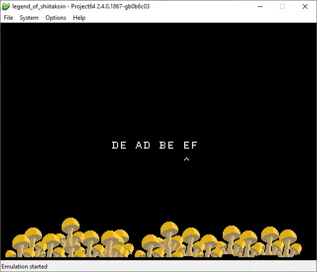{: .mx-auto.d-block :}

Presumably, if we enter the right inputs, this will print a flag to the screen instead of `INCORRECT`. 

Similarly, the second stage had a little mushroom you could move around which would update x,y coordinates on the screen. The goal, I guess, is to input at certain coordinates to print the flag to the screen.

{: .mx-auto.d-block :}

## Approach

I had a few ideas as to how I might approach this challenge. The simplest approach would be to try to brute force the game, but `0xFFFFFFFF` is a really big number and would take a very long time to solve. I only just regained access to power on Sunday midday of the event, meaning I only had a 3 hours before the CTF finished, and this approach wasn't an option.

My next thought was that maybe I could attach a debugger and try to skip the instructions checking that the inputs were correct, or just force it to accept whatever input, and maybe the flag would be displayed to the screen.

With a bit of googling, I realized Project64 has a [debugger](https://hack64.net/docs/pj64d/) that I could work with, so started here. 

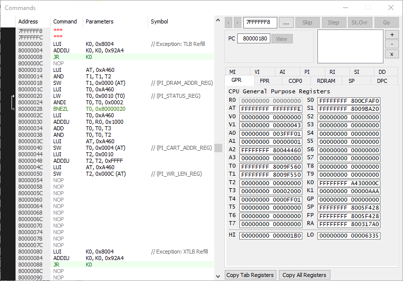{: .mx-auto.d-block :}

It was pretty straight forward to setup, but I had a problem. I still needed to figure out where to set breakpoints and where the interesting code was. 

I like to use [Ghidra](https://ghidra-sre.org/) for this sort of thing, though it doesn't know how to interpret `.n64` file types by default. It didn't take long to find [zeroKila's](https://github.com/zeroKilo/N64LoaderWV) loader module, though. After following the instructions to add his loader as an extension to Ghidra, opening `legend_of_shiitakoin.n64`, and analyzing the file with the default settings, I could start to explore the code.

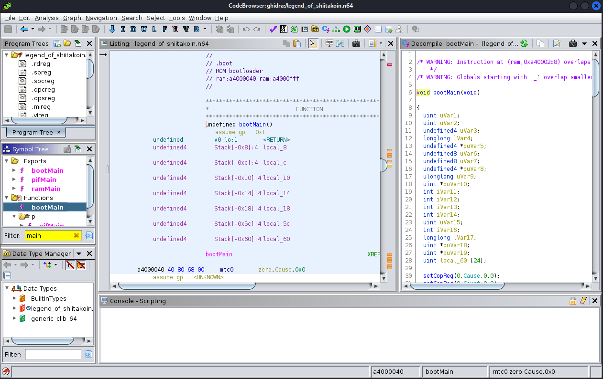{: .mx-auto.d-block :}

My current plan is still just to skip the input validation and hopefully print the flag, so I need to find where that print occurs. I started by searching for strings in the file...

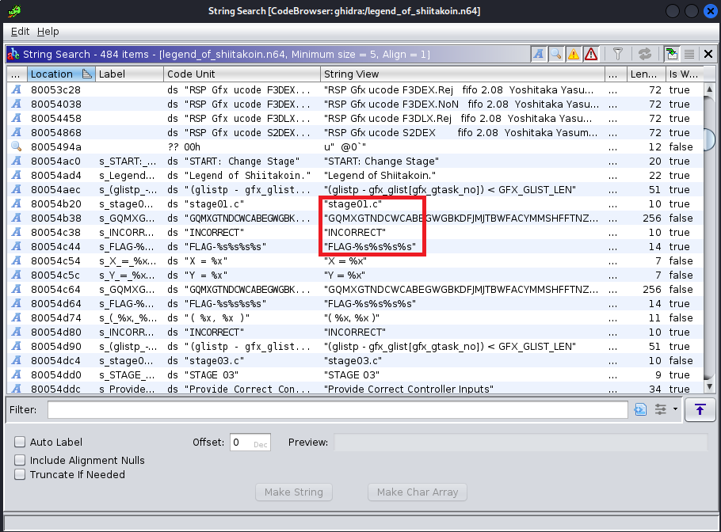{: .mx-auto.d-block :}

## Stage1

By following the xref to the "FLAG-%s%s%s%s" string, I landed on a function at `0x800276d0`. Let's use that as the breakpoint in the Project64 Debugger and explore from there.

After setting the breakpoint, I was still able to change the inputs to the screen without hitting the breakpoint, and as soon as I tried to submit them, I did hit the breakpoint. This is a good sign - it means we're in the right function.

After stepping over a few functions and watching the game, I determined that the function call at `0x80027714` was checking the inputs, and based on the return value will either print `INCOMPLETE` or continue to new code. Examining the disassembled code at this location confirms this.

```c
FUN_80030b64(auStack296,0xffffffff80054b38,0x100);
FUN_80029100();
FUN_800291b4();
lVar1 = CheckInputs(); //function call at address 0x80027714
if (lVar1 != 1) {
	do {
		ScreenTick2(0,0xf,0xf);
		PrintString(0,0xffffffff80054c38);
		FUN_8002bb3c(1);
		ScreenLoop(0);
	} while( true );
}
//...new code
```

All I had to do was replace the V0 register that stores the returned value from the function call with a 1, and the *Branch if Equal* (BEQ) should trigger, shown in the debugger:

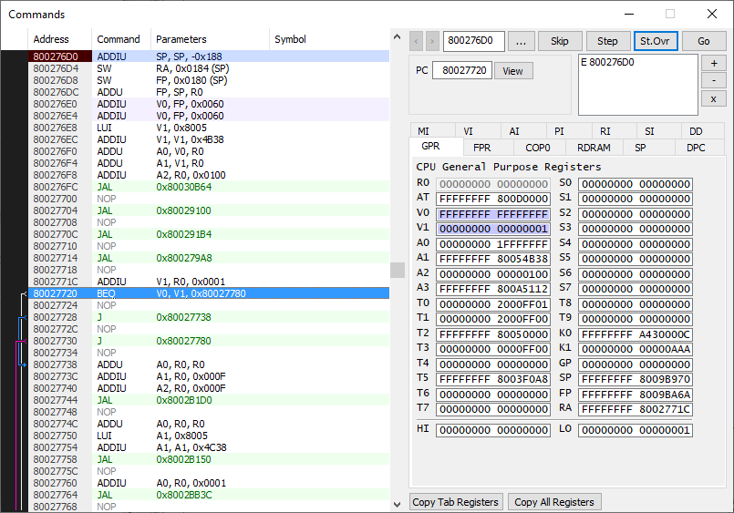{: .mx-auto.d-block :}

Success, I printed *a* flag!

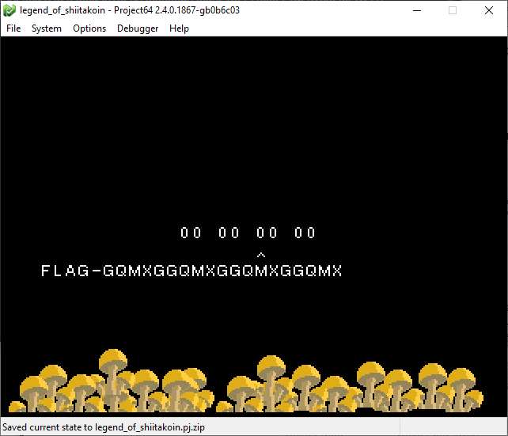{: .mx-auto.d-block :}

## The way they wanted you to do it

It's not the right flag, though. In fact, a bit more examination shows that the flag is built programatically from the string "GQMXGTNDCWCA...", shown in one of the previous images. The string is 255 characters long, and each input from this stage will grab the *n*-th chunk of 5 characters from that string and concatenate them as the flag. This is obvious in the previous image when `0x00` is used as all 4 inputs... the flag is simply "GQMXG" repeated 4 times (minus 1 character for the last input).

So what does this mean? Well, it means we'll have to input the proper values after all.

If we examine the function that is *supposed* to return a value of 1, we find the following code:

```c
if (((DAT_800570e0 ^ DAT_800570e1) & 0xf0) == 0xf0) {
  if (((DAT_800570e0 ^ DAT_800570e1) & 0xf) == 0xd) {
    if (DAT_800570e2 == -0x73) {
      if (DAT_800570e3 == 0x3f) {
        if ((char)(0x8d >> (DAT_800570e0 & 3)) == '\x11') {
          local_c = DAT_800570e3;
          for (local_58 = 0; local_58 < 3; local_58 = local_58 + 1) {
            local_c = local_c & 0xe5 | (char)local_58 + 0x2cU;
          }
          if (local_c == 0x2f) {
            if (DAT_800570e0 == 0xa3) {
              if (DAT_800570e1 == 0x5e) {
                uVar1 = 1;
              }
//many else statements of uVar1 = -1;
return uVar1;
```

If we examine the 4 bytes starting at memory address `0x800570e0` which correspond to the 4 main variables used in this function, it's obvious that they are our 4 inputs.

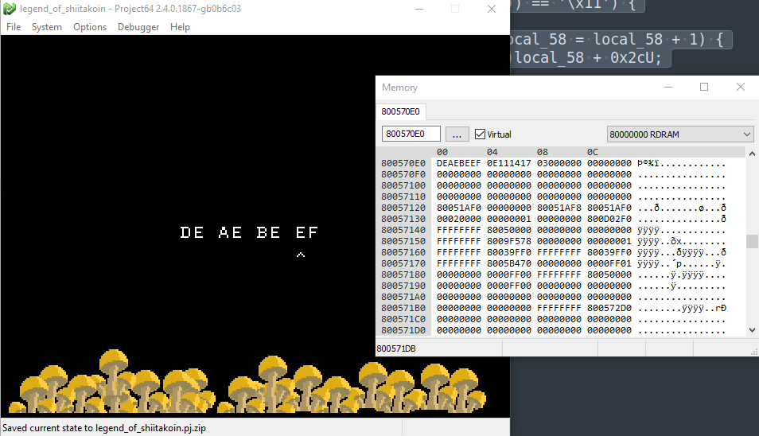{: .mx-auto.d-block :}

All we have to do is choose data that passes all these if statements such that the code reaches the line to set `uVar1 = 1`. In fact, most of the checks make that exceedingly simple:

```c
DAT_800570e0 == 0xa3  //var0 must be 0xa3
DAT_800570e1 == 0x5e  //var1 must be 0x5e
DAT_800570e2 == -0x73 //var2 must be 0x8D (two's complement)
DAT_800570e3 == 0x3f  //var3 must be 0x3f
```

## Flag 1

Inputting the determined values into the game...

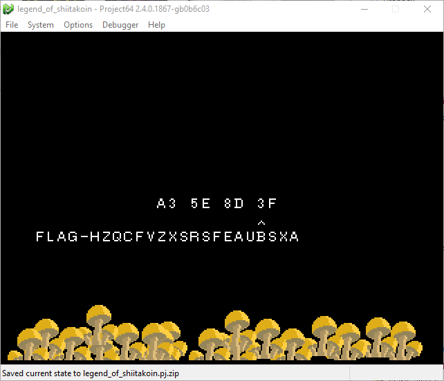{: .mx-auto.d-block :}

...and we get our flag! For a solid 4 points:
**FLAG-HZQCFVZXSRSFEAUBSXA**.

## Stage 2

At this point, there were 45 minutes left until the end of the competition. I wasn't hopeful that I could finish this next flag in time, but doggonnit I was ganna try!

Similar to before, I found the next time the string "FLAG-%s%s%s%s" was printed, which was shortly after the string "stage03.c". Apparently there is no stage02. Whatever.

Following the xref back to a function at `0x80028410`, I stepped through with the debugger by setting some strategic breakpoints until I eventually found a function call at `0x80028b84` that seemed to serve the same purpose as with the previous flag - if it returns 1, then instead of printing `INCOMPLETE` to the screen, some new code can be reached.

The function it calls can be found at `0x80028698`:
```c
if ((_DAT_800570f8 & 0x80) == 0) {
  uVar1 = 0xffffffffffffffff;
}
else if ((_DAT_800570fc & 1) == 0) {
  if ((_DAT_800570fc & 0x80) == 0) {
    if ((_DAT_800570f8 & 0x20) == 0) {
      uVar1 = 0xffffffffffffffff;
    }
    else if ((_DAT_800570fc & 0x40) == 0) {
      uVar1 = 0xffffffffffffffff;
    }
    else if ((_DAT_800570f8 & 0x40) == 0) {
      if ((_DAT_800570fc & 0x20) == 0) {
        if ((_DAT_800570f8 & 2) == 0) {
          uVar1 = 0xffffffffffffffff;
        }
        else if ((_DAT_800570fc & 4) == 0) {
          uVar1 = 0xffffffffffffffff;
        }
        else if ((_DAT_800570fc & 2) == 0) {
          uVar1 = 0xffffffffffffffff;
        }
        else if ((_DAT_800570f8 & 1) == 0) {
          uVar1 = 0xffffffffffffffff;
        }
        else if ((_DAT_800570fc & 0x10) == 0) {
          if ((_DAT_800570f8 & 0x10) == 0) {
            if ((_DAT_800570fc & 8) == 0) {
              uVar1 = 0xffffffffffffffff;
            }
            else if ((_DAT_800570f8 & 8) == 0) {
              if ((_DAT_800570f8 & 4) == 0) {
                uVar1 = 1;
              }
//many else statements of uVar1 = 0xffffffffffffffff (-1)
return uVar1;
```

This code is a bit more complicated then the previous flag's, but still not too bad. It seems to be using bitwise operators to check that the 2 inputs pass various checks. Let's clear up the code a little bit by replacing `0xffffffffffffffff` with `-1` and some better variables names.

```c
if ((input0 & 0x80) == 0) {
  returnVar = -1;
}
else if ((input1 & 1) == 0) {
  if ((input1 & 0x80) == 0) {
    if ((input0 & 0x20) == 0) {
      returnVar = -1;
    }
    else if ((input1 & 0x40) == 0) {
      returnVar = -1;
    }
    else if ((input0 & 0x40) == 0) {
      if ((input1 & 0x20) == 0) {
        if ((input0 & 2) == 0) {
          returnVar = -1;
        }
        else if ((input1 & 4) == 0) {
          returnVar = -1;
        }
        else if ((input1 & 2) == 0) {
          returnVar = -1;
        }
        else if ((input0 & 1) == 0) {
          returnVar = -1;
        }
        else if ((input1 & 0x10) == 0) {
          if ((input0 & 0x10) == 0) {
            if ((input1 & 8) == 0) {
              returnVar = -1;
            }
            else if ((input0 & 8) == 0) {
              if ((input0 & 4) == 0) {
                returnVar = 1;
              }
//many else statements of returnVar = -1
return returnVar;
```

Some of the if statements, when true, will result in a returnVar that we **don't** want, others are branches we **do** want to take.

A quick table to summarize our findings, sorted by MSB:
|No Branch|Yes Branch|No Branch|Yes Branch|input0 bits|input1 bits|
| :----------- | :----------- | :----------- | :----------- | :---: | :---: |
|(input0 & 0x80) == 0|||(input1 & 0x80) == 0|1|0|
||(input0 & 0x40) == 0|(input1 & 0x40) == 0||0|1|
|(input0 & 0x20) == 0|||(input1 & 0x20) == 0|1|0|
||(input0 & 0x10) == 0||(input1 & 0x10) == 0|0|0|
||(input0 & 8) == 0|(input1 & 8) == 0||0|1|
||(input0 & 4) == 0|(input1 & 4) == 0||0|1|
|(input0 & 2) == 0||(input1 & 2) == 0||1|1|
|(input0 & 1) == 0|||(input1 & 1) == 0|1|0|

## Flag 2

Taking the bits from the right two columns, the two input values `x` and `y` should be `0xa3` and `0x4e`.

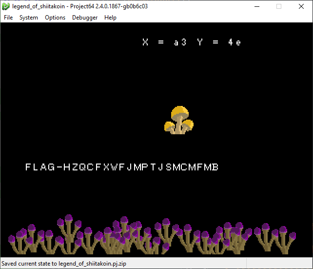{: .mx-auto.d-block :}

With 3 minutes to spare before the end of the CTF, our final flag for 4 points:  
**FLAG-HZQCFXWFJMPTJSMCMFMB**.
