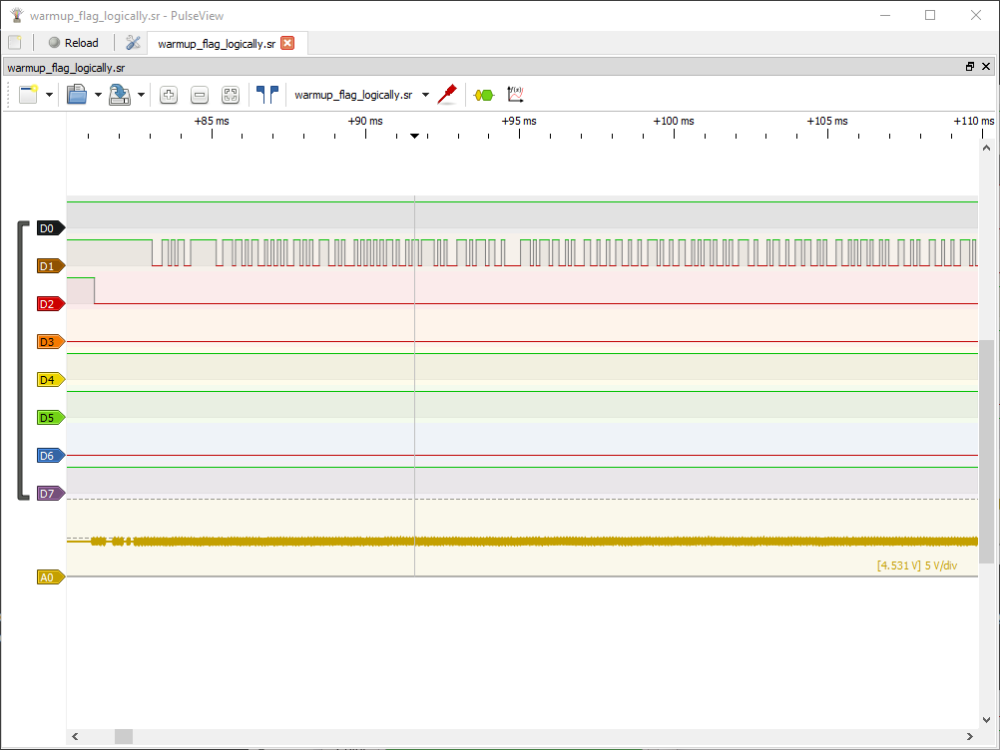
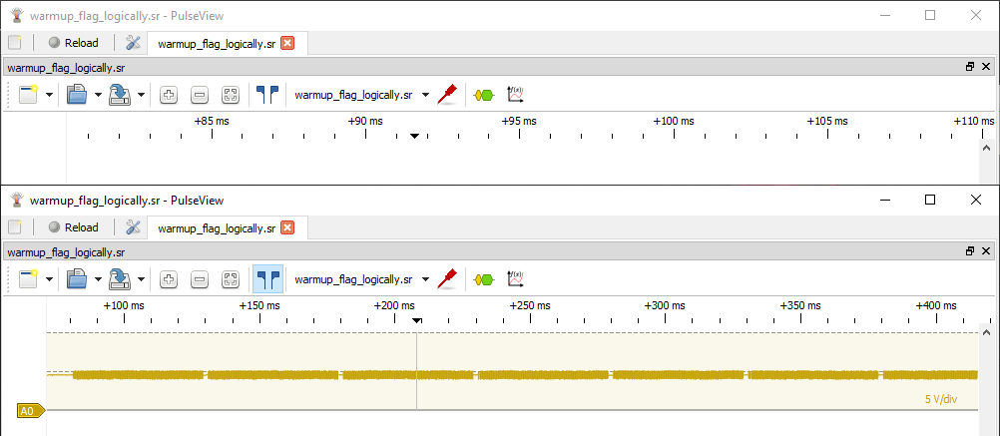
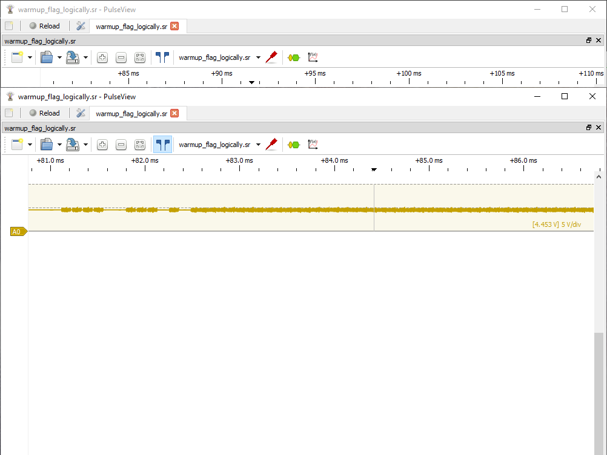
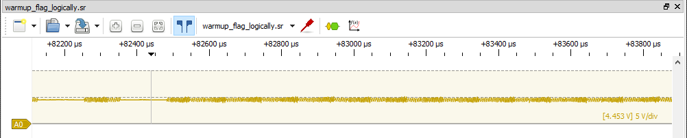
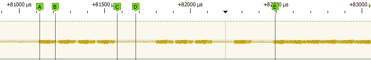
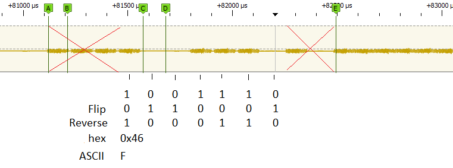
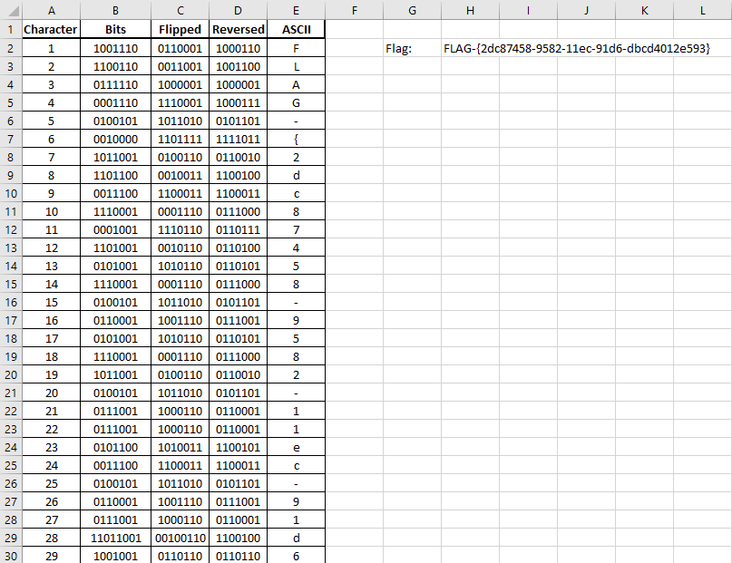

*Nitrate* has a good writeup for the main flag of this challenge, which can be found [here](https://n1trate.github.io/writeups/nsec-2022-warmup/warmup-challenge-logically/). Without repeating any details he's already covered, let's solve the bonus flag.

The first flag made use of the `D1` and `D2` digital channels - the bonus flag is hidden in the `A0` analog signal. 

{: .mx-auto.d-block :}

## Initial Exploration

Zooming out a little bit, I could count 43 discrete blocks of data in the signal. Odds are, each of these blocks represents a character of the flag we're after.

{: .mx-auto.d-block :}

Based on the first image, though, I knew the data wasn't homogeneous across the entirety of any given chunk. At the start of any given... - let's just refer to these blocks of data as *characters*, since that's the assumption I'm working off of - there are distinct changes in the signal, followed by a relatively very long signal of what looks to be *noise*. Here's the first *character* to show you what I mean.

{: .mx-auto.d-block :}

I use the word *noise* very intentionally. I tried to apply various analyzers to this area, but even just looking at it, it is too homogeneous. You could attempt to zoom **WAY** in and correlate the fluctuations in voltage to 1s and 0s, but aside from a periodic increase in frequency, which is sort of visible in the image below, I couldn't imagine any relevant data being hidden in this noise.

{: .mx-auto.d-block :}

Instead, I chose to focus my efforts on the easily identifiable changes in signal at the start of each *character*. Knowing that the first flag of this challenge was encoded using UART, I thought maybe this data needed to be converted to a digital signal and decoded the same way. I tried various methods to analyze and convert this to a digital signal, but wasn't having much luck.

## Decoding the data

Eventually, I decided to try a more manual approach. I wanted to understand and identify how potential data was encoded here before I'd consider applying a transform to decode it programatically.

Looking at the signal in front of the first *character*, instead of trying to interpret high and low voltages as 1s and 0s like you would with a digital signal, it seemed a better approach to instead interpret a given period of roughly 5µs as being either "on" or "off", i.e., 1s or 0s. .

You can see what I mean in the following image, where labels `A-B` represent a `1`, labels `C-D` represent a `0`, and label `E` is where the *noise* starts for the remainder of the signal representing a *character*

{: .mx-auto.d-block :}

From here, I stepped across the first couple characters and mapped out my interpretations of 1s and 0s to see if anything stood out.

| Character | Bits |
| :------: | :---: |
| 1 | 111100111010 | 
| 2 | 111110011010 |
| 3 | 111011111010 |
| 4 | 111000111010 |
| 5 | 111010010110 |

One thing that stands out to me is that every *character* starts with `111`, and ends with `10`. I quickly scrolled through a few more *characters* to confirm that this pattern continued. 

I think it's a safe to assume that since there is no *change* in the data, there is no information to be gleaned from looking at these particular bits. They are likely just used as a sort of `STOP` and `START` signal for the encompassing bits. That leaves us with the following information:

| Character | Bits |
| :------: | :---: |
| 1 | 1001110 | 
| 2 | 1100110 |
| 3 | 0111110 |
| 4 | 0001110 |
| 5 | 0100101 |

I'm getting a bit excited now, because we're left with 7 bits of information - the exact number of bits required to represent ASCII text! There's a problem though... these bits, in their current form, don't all correspond to printable characters.

| Character | Bits | ASCII |
| :------: | :---: | :---: |
| 1 | 1001110 | N |
| 2 | 1100110 | f |
| 3 | 0111110 | > |
| 4 | 0001110 | `SO` |
| 5 | 0100101 | % |

The first flag in this challenge, as per the challenge statement, followed the form "FLAG-{ }". Maybe there's a way to correlate these first characters into "FLAG-".

| Target | Bits | Character | Bits |
| :------: | :---: | :------: | :---: |
| F | 1000110 | 1 | 1001110 | 
| L | 1001100 | 2 | 1100110 |
| A | 1000001 | 3 | 0111110 |
| G | 1000111 | 4 | 0001110 |
| - | 0101101 | 5 | 0100101 |

Notice *character* 3, and compare it to the bits of ASCII `A`. They're both palindromes, but the bits are flipped. Let's follow this thread and flip the bits of our *characters* and see if they look better.

| Target | Bits | Character | Bits | ASCII |
| :------: | :---: | :------: | :---: | :---: |
| F | 1000110 | 1 | 0110001 | 1 |
| L | 1001100 | 2 | 0011001 | `DC3` |
| A | 1000001 | 3 | 1000001 | A |
| G | 1000111 | 4 | 1110001 | q |
| - | 0101101 | 5 | 1011010 | Z |

Still no luck on the ASCII, but the pattern between the target and current bits almost jumps out. The *character* bits just need to be reversed to match! 

Here's the steps required shown on the first *character* block of data, to decode the signal to the ASCII character `F`.

{: .mx-auto.d-block :}

Stepping through the rest of the data and using some excel magic, the flag can be deciphered. 

I input the data in Column B. 
Column C uses the following formula to flip the bits: 
`=SUBSTITUTE(SUBSTITUTE(SUBSTITUTE(B2,1,2),0,1),2,0)` 
Column D uses the following formula to reverse the bits: 
`=TEXTJOIN("",1,MID(C2,{7,6,5,4,3,2,1},1))` 
Finally, Column E uses this formula to convert the binary to an ASCII character: 
`=CHAR(BIN2DEC(D2))` 

The final flag: **FLAG-{2dc87458-9582-11ec-91d6-dbcd4012e593}**.

{: .mx-auto.d-block :}

You can download the excel file [here](../assets/files/logically_bonus.xlsx).
